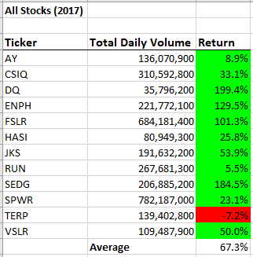
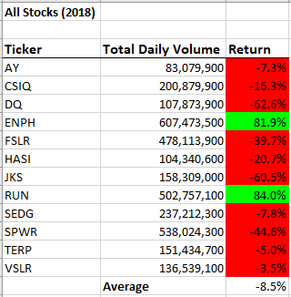
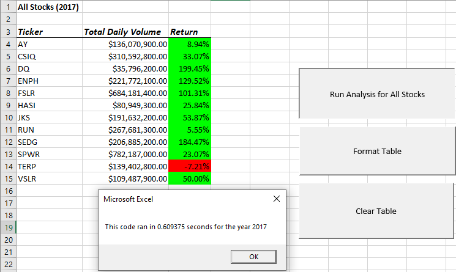
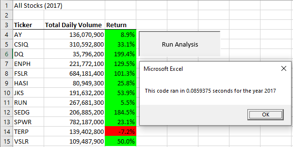
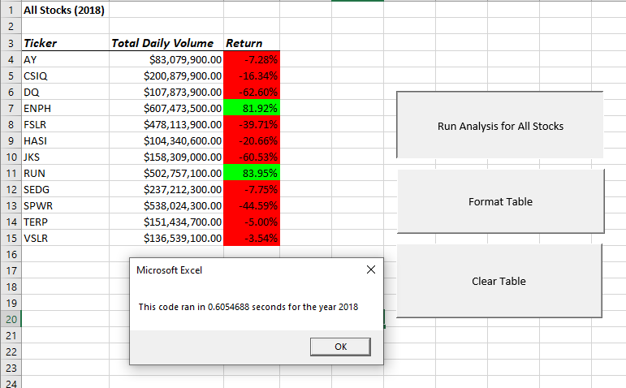
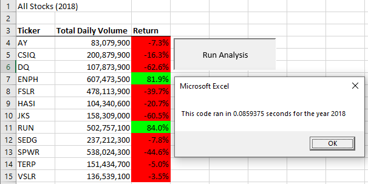
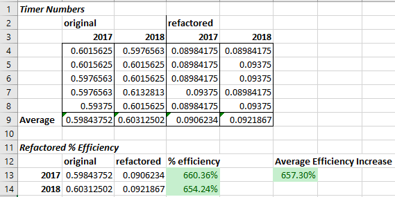

# 2017-2018 Stock Analysis

### The Purpose:
We were given two years of stock information and the goal of determining how much total volume was traded daily, and the annual return. I then refactored the code used to analyze the stocks to see if I can make it more efficient. Running a timer will tell me how long it takes for my code to execute, and the goal is to reduce that time. I will then weigh the pros and cons of the original code vs the refactored code.

## Results
### Stock Analysis:
In 2017 11/12, of the stocks analyzed profited through the year, while in 2018 only 2/12 were profitable. While most of the stocks seemed to not fare as well in 2018, ENPH and RUN were profitable both years; with ENPH having a total increase of over 211.4%. This shows resilience in the stock, and would indicate that either may be a good choice, although ENPH did show significantly higher gains over the two years.  
  
**2017 Results**  
  
  
**2018 Results**  
  
  
### Refactoring Analysis:
By creating a variable to represent the ticker index `ticketIndex = 0`, I can incriment the index `tickerIndex = tickerIndex + 1` to move to the next ticker; rather than looping through the entire list again for the each ticker. This significantly reduced processing time required to analyze the data.  
  
**2017 Original Timer**  
  
  
**2017 Refactored Timer**  
  
  
**2018 Original Timer**  
  
  
**2018 Refactored Timer**  
  
  
## Summary
### Pros/Cons of Refactoring:
In this case I was able to significantly reduce the time it takes to execute the code and calculate data. This would be especially helpful when analyzing a very **large** dataset. I did a few trial runs of the original code and the refactored code, documented the timers, and then averaged it out to see approximately how much I improved the efficiency of the code when it comes to the timer. Refactoring the code, on average, increased the efficiency by approximately 657.3% when measuring the time it takes to run the code. One downside to using this method is that you would have to know how many ticker items are in the array, and arrange the array or the dataset to match the order of the index. It would require some modifications in order to count how many different ticker items there are and then sort them alphabetically so that the ticker symbols would align with the correct data.  
  
  
### Pros/Cons of Original Code
In the original code it is looking to match the specific ticker with the related data. This code would work with less sorting and organization required, although the code does take longer to execute because it is looping through the data for each ticker item.
